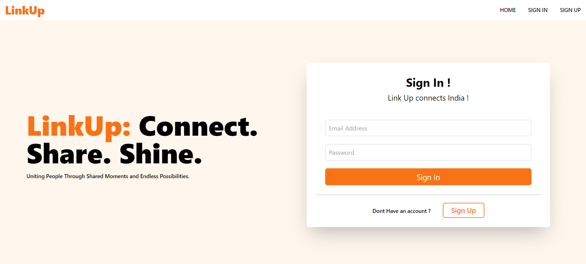

# LinkUp Social-Site (Frontend)
This repository contains the frontend code for a server, serving as the frontend of a web application. LinkUp is a dynamic social networking platform made using ReactJs. 

##  About Me
###  Hi, I'm Amrish! 👋
#### I'm a full stack developer[MERN]...

[](https://www.amrishpratapsingh.com/)    [](https://www.linkedin.com/in/amrishkush/)

## Backend Part 
Click to See Code!
[Backend Code](https://github.com/Amrishkush/linkup-social-site-server)

## Features

- Create Account
- Sign In 
- See Profile
- Cover and Profile Image
- Sign Out 

## Installation

1. Clone the repository:

   ```bash
   git clone https://github.com/Amrishkush/linkup-social-site-client

   ```

2. Navigate to the project directory:

   ```bash
   cd linkup-social-site-client

   ```

3. Install dependencies:

   ```bash
   npm install

   ```

## Usage

1. Start the development server:

   ```bash
   npm run dev
   ```

## Technologies Used

- React.js
- Vite
- React Router
- Axios for API requests
- Tailwind CSS for styling

## Project Structure

 - **public/**
 - **src/**
    - **assets/**
    - **components/**
        - Header.jsx
        - Home.jsx
        - SignIn.jsx
        - SignUp.jsx
    - **pages/**
        - ProfilePage.jsx
    - **utils/**
        - apiURL.js
    - app.css
    - app.jsx
    - index.css
    - main.jsx

## Screenshot



## Demo

Click to Visit!
[LinkUp](https://linkup.amrishpratapsingh.com)
